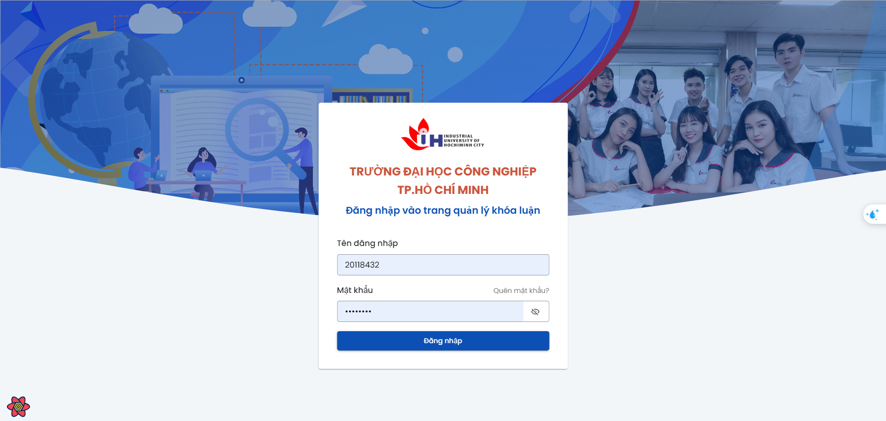

# Thesis Management System

Welcome to the **Thesis Management System**! This project is designed to streamline the process of managing theses for both students and faculty members. With a user-friendly interface and robust features, managing your academic work has never been easier.

# Repositories
### Frontend
- **Student Dashboard**: Students to manage thesis tasks.  
  [Frontend Student Repository](https://github.com/Quindart/education-graduation-for-student-iuh)
- **Lecturer Dashboard**: Designed for lecturers to oversee student progress.  
  [Frontend Lecturer Repository](https://github.com/Quindart/education-manager-graduation-student-iuh)
### Backend
- **Node.js Backend**: Handles API integration, data processing, and thesis management logic.  
  [Backend Node.js Repository](https://github.com/Quindart/fork-manage-graduation-thesis-iuh-be)
- **Python Backend**: Powers chatbot functionality for user support.  
  [Backend Python Repository](https://github.com/Quindart/manage-graduation-thesis-iuh-chatbot)
### Mobile
- **Mobile App**: Allows students to manage tasks
 [Mobile Repository](https://github.com/Quindart/manage-graduation-thesis-iuh-fe-app)




## Features

-  **Thesis Submission**: Allows students to submit their thesis proposals and final documents.
-  **Advisor Assignment**: Facilitates the assignment of advisors to students based on their research topics.
- **Schedule Management**: Helps in scheduling important dates like proposal submission, defense, and final submission.
-  **Review and Feedback**: Enables advisors and committee members to review theses and provide feedback.
-  **Progress Tracking**: Tracks the progress of each thesis from submission to completion.
-  **User Authentication**: Ensures secure access with role-based permissions for students, advisors, and administrators.
-  **Document Management**: Manages all documents related to each thesis in an organized manner.
- **Reports and Analytics**: Generates reports and analytics to monitor overall thesis management performance.

##  Installation

Follow these steps to set up the project locally:

1. **Clone the repository**:
   ```bash
   https://github.com/Quindarts/education-manager-graduation-student-iuh.git
   ```
2. **Navigate to the project directory**:
   ```bash
   cd thesis-management-system
   ```
3. **Install dependencies**:
   ```bash
   npm install
   ```
4. **Set up the database**:
   - Configure your database settings in `config/database.js`.
   - Run the migrations:
     ```bash
     npm run migrate
     ```
5. **Start the development server**:
   ```bash
   npm run dev
   ```
6. **Access the application**:
   Open your browser and navigate to `http://localhost:5173`.

## Usage

### For Students

- **Submit Thesis**: Fill out the submission form and upload your document.
- **View Feedback**: Check feedback and comments from your advisor and committee.
- **Track Progress**: Monitor your thesis progress and deadlines.

### For Advisors

- **Review Theses**: Access and review submitted theses.
- **Provide Feedback**: Give detailed feedback and recommendations to students.
- **Manage Advisees**: View and manage your list of advisees.

### For Administrators

- **User Management**: Add, update, or remove users and assign roles.
- **Schedule Management**: Set and update important dates and deadlines.
- **Generate Reports**: View and generate reports on thesis submissions and completions.

## Deployment

To deploy the project to a production environment:

1. **Set environment variables**:

   - Create a `.env` file in the root directory.
   - Add the necessary environment variables (e.g., database credentials, API keys).

2. **Build the project**:

   ```bash
   npm run build
   ```

3. **Start the production server**:
   ```bash
   npm run start:prod
   ```

## Contributing

We welcome contributions! Please follow these steps to contribute:

1. **Fork the repository**.
2. **Create a new branch**:
   ```bash
   git checkout -b feature/your-feature-name
   ```
3. **Make your changes**.
4. **Commit your changes**:
   ```bash
   git commit -m "Add your message"
   ```
5. **Push to your branch**:
   ```bash
   git push origin feature/your-feature-name
   ```
6. **Create a Pull Request**.

## License

This project is licensed under the MIT License. See the [LICENSE](LICENSE) file for details.

## Contact

For any questions or feedback, please reach out to:

- **Email**: quangiuhdev@gmail.com
- **GitHub**: [Quindarts](https://github.com/Quindarts)

---

_Happy Coding!_ 🚀
